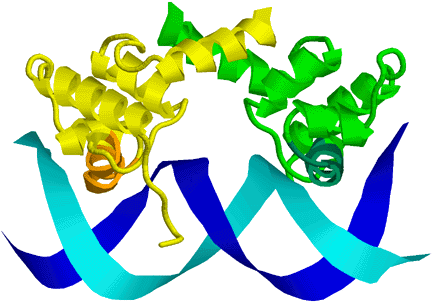

Palindromes in Genomic sequences
--------------------------------

Note: this assignment was originally created by David Bernick, then
edited by Kevin Karplus. Both are about equally responsible for the
final shape of the assignment.

Feature prediction within genomic data is a powerful method for us to
learn novel relationships armed with little more than a biological model
and a way to express that model in terms of a score. You have seen
already that when we can score nature's choices for amino acid
substitution, we can use that score as a means to align protein
sequences. Similar models can be created to infer phylogeny, ancestral
sequences or in searches for sequences that code for RNA structures
(e.g., tRNA or snoRNA).

Proteins that bind specific regions of DNA, either as a regulation
mechanism (transcription factors), or to recognize foreign DNA (phage
DNA) need to make use of short sequences. These sequences need to be
short in order to minimize the complexity of the binding protein, and
they need to be specific in order to produce a specific regulatory
effect. Consider, for example, what would happen if a regulatory protein
that targets destruction of viral DNA happened upon that same sequence
within the host genome. The benefits to the host of reserving these
“special words” can now be seen. Since the machinery that makes use of
these “special words” is also quite complex, we would tend to see them
preserved over evolutionary time.

One class of special words appear to be DNA palindromes, which are
reverse-complement palindromes (that is, the word is the same on both
strands of the DNA—reversing the word and complementing it gives you
back the word). For example, “TATA” is one of the more important
palindromic sequences, used to signal start of transcription
(<http://www.pdb.org/pdb/101/motm.do?momID=67>). It can be written as: T
A A' T', where A' means the reverse complement of A (T), and T' means
the reverse complement of T (A). Palindromes are common recognition
sites, because many of the DNA-binding proteins bind as dimers or with
two copies of the same protein domain, with the two chains having the
DNA binding sites facing each other and recognizing corresponding
sections on the forward and reverse strands, as can be seen in this
cartoon picture of the PDB file 1LMB:

Rocha et al. (<http://genome.cshlp.org/content/11/6/946.full>
doi:[10.1101/gr.153101](http://dx.doi.org/10.1101/gr.153101)), noticed
that palindromes of size 4 and 6 seem to be under-represented in some
prokaryotic genomes. They suggest that this may be due to particular
structures (restriction or modification systems) that exist in some
prokaryotes and some phage (lambda for example). This may be a mechanism
for establishing exclusive use or restricting use of these words within
a genome.

So, armed with the possibility that there exist special words, and that
these words are sometimes palindromes, can we now see if we can find
them in our genome of choice?

For us to predict when a word is missing or under-represented, we need
to have a model of the frequency with which we would expect a particular
word—this will be our null model. We want to find the palindromes that
occur significantly less frequently than would be expected.

There are many null models that are possible, and for this assignment we
will make use of a Markov model that models extending the central
palindrome in both directions. Note: nothing in this null model is
restricted to palindromes—we could use this model to look for any
under-represented n-mer. The symmetry of extending in both directions
from the central (n–2)-mer is particularly elegant for palindromes, but
a very similar method can be made by using an order (n–2) Markov model
as the null model. Somewhat surprisingly, the calculation for the
expected count comes out the same in either model

To compute the probability that an arbitrary n-mer is the word (W) that
we are interested in, we will use 3 components: the probability that the
core (n-2) bases match, and the probabilities of the first and last
bases given that the core matches.  

P(W) = P(W1 | W2...Wn-1) \* P(Wn | W2...Wn-1) \* P(W2...Wn-1)

If we check for the palindrome N times (roughly the length of the
genome), we would expect to see N\*P(W) occurrences of W. We can use
counts and maximum-likelihood estimates of the probabilities in our null
model to get an estimation formula:  

E(C(W)) = C(W1...Wn-1X) \* C(XW2...Wn) / C(XW2...Wn-1X)

where E(C(W)) is the expected value for the count of the number of
times W occurs in the genome, and C(Wi...Wj) is the actual count of
the number of times the word Wi...Wj occurs. The 'X' character on
the subwords is intended to represent "any character". We are counting
the number of words of length n that agree on the first n-1, the second
n-1, or the middle n-2 positions. In practice, since our genome
sequences are very long, we can ignore edge effects and just use  

E(C(W)) = C(W1...Wn-1) \* C(W2...Wn) / C(W2...Wn-1)

If n=2, we are not counting empty strings on the bottom, but the number
of 2-letter windows in our training data. (Actually, I counted the
number of letters, which is slightly larger.)

Because our model for the count is the sum of N almost independent
observations, each with probability P(W), it can be well modeled as a
binomial distribution, with variance  

Var(C(W)) = N\* P(W) \* (1-P(W)) = E(C(W)) \* (1 - E(C(W))/N)

and the standard deviation is  

sigma(W) = sqrt(E(C(W)) \* (1 - E(C(W))/N))

Note: because E(C(W)) is much smaller than N, the variance is approximately the same as the mean.

We can then compute a Z-score for each of our words:  

Z(W) = (C(W) – E(C(W))) / sigma(W)

Using a Z-score is quite reasonable here, because we are expecting a distribution very close to a normal
distribution.

How big a palindrome can we use this method on? As the palindromes get
bigger, the expected counts get smaller, and it is harder to tell
whether the number is really significantly smaller than expected. Say we
want to have 0.01 probability of a false positive. If we check 4\^4
(256) palindromes (the number of palindromes of length exactly 8), we
would need a p-value \< 3.9E-05 to get an E-value \< 0.01. According to
a normal probability table
(<http://www.math.unb.ca/~knight/utility/NormTble.htm>), we would need a
Z-score \< -4 for this level of significance. For a zero count to be at
least 4 standard deviations below the expected value, we would need for
the expected value to be at least 16. For a megabase genome, the
expected number of counts for the 4\^8 (64k) different 8-mers should be
around 16, so 8-long palindromes are about as big as we can go. For
longer palindromes, even a count of zero would not mean significant
under-representation.

Note that if we wanted to check all 64k 8-mers for under-representation
and not just the 256 palindromes, we'd need a probability of 1.5E-07 of
a false positive, or a Z-value around -5.1. This would require expected
counts of at least 26 on a 1.7 megabase genome.

Assignment
----------

Part 1: write a short piece of python code that generates all DNA
palindromes for a given range of lengths. I found it useful to first
write a (recursive) generator function yielding all k-mers over a given
alphabet for a fixed value of k. I also found the following function
useful:

    # define reverse complement
    complement_table = string.maketrans("ACGT", "TGCA")
    def reverse_comp(dna):
        """return a string with the reverse-complement of the DNA string "dna".
        Assumes that all bases in DNA are canonical (ACGT).
        To generalize to wildcard bases, complement_table would need
        to be redefined.
        """
        return dna[::-1].translate(complement_table)

The definition of DNA palindrome above does not allow odd-length
palindromes, since the middle letter is never the complement of itself.
In practice there are often unimportant bases in the middle of a
matching sequence, so let's add "odd palindromes" that have an extra
letter in the middle: `dna+'A'+reverse_comp(dna)`,
`dna+'G'+reverse_comp(dna)`, and so forth ...

Part 2:

Write a program, named score\_palindromes, that reports significantly
under- or over-represented palindromes. The program should have at least
the following options:

-   `-e` or `--max_e=0.1` which specifies the maximum E-value to include in your report. The
        program should report both under- and over-represented palindromes
        with E-values ≤ max\_e.
-   `-k` or `--max_k==8` which specifies the maximum size palindrome to look for.
-   `-m` or `--min_k==2` which specifies the minimum size palindrome to look for.
-   `filename arguments` any number of file names for FASTA files of genomes, any of which
        may be gzipped (indicated by the file name ending with ".gz"). If none
        are provided, read (uncompressed) input from stdin.

Your program would then be executed as follows (for example):

    search_nmer -e 0.01 --max_k=8 P.abyssi.fa.gz P.furiosus.fa.gz P.horikoshii.fa.ga

Note: you can open a gzipped file in python fairly easily using the
`gzip` module.

    file = gzip.GzipFile(filename,'r') if filename.endswith(".gz") 
            else open(filename,'r')

I will provide a few genomes for various prokaryotes as FASTA files
(actually, as gzipped fasta files). 
[A.fulgidus.fa.gz](http://www.soe.ucsc.edu/classes/bme205/Fall05/A.fulgidus.fa.gz) 
[A.pernix.fa.gz](http://www.soe.ucsc.edu/classes/bme205/Fall05/A.pernix.fa.gz) 
[H.influenzae.fa.gz](http://www.soe.ucsc.edu/classes/bme205/Fall05/H.influenzae.fa.gz) 
[H.pylori.fa.gz](http://www.soe.ucsc.edu/classes/bme205/Fall05/H.pylori.fa.gz) 
[M.jannaschii.fa.gz](http://www.soe.ucsc.edu/classes/bme205/Fall05/M.jannaschii.fa.gz) 
[M.thermoautotrophicus.fa.gz](http://www.soe.ucsc.edu/classes/bme205/Fall05/M.thermoautotrophicus.fa.gz) 
[N.meningitidus.fa.gz](http://www.soe.ucsc.edu/classes/bme205/Fall05/N.meningitidus.fa.gz) 
[P.abyssi.fa.gz](http://www.soe.ucsc.edu/classes/bme205/Fall05/P.abyssi.fa.gz) 
[P.furiosus.fa.gz](http://www.soe.ucsc.edu/classes/bme205/Fall05/P.furiosus.fa.gz) 
[P.horikoshii.fa.gz](http://www.soe.ucsc.edu/classes/bme205/Fall05/P.horikoshii.fa.gz) 
[S.acidocaldarius.fa.gz](http://www.soe.ucsc.edu/classes/bme205/Fall05/S.acidocaldarius.fa.gz) 
[S.solfataricus.fa.gz](http://www.soe.ucsc.edu/classes/bme205/Fall05/S.solfataricus.fa.gz) 
[S.tokadaii.fa.gz](http://www.soe.ucsc.edu/classes/bme205/Fall05/S.tokadaii.fa.gz) 
[V.cholerae.I.fa.gz](http://www.soe.ucsc.edu/classes/bme205/Fall05/V.cholerae.I.fa.gz) 
[V.cholerae.II.fa.gz](http://www.soe.ucsc.edu/classes/bme205/Fall05/V.cholerae.II.fa.gz) 
[V.fischeri.I.fa.gz](http://www.soe.ucsc.edu/classes/bme205/Fall05/V.fischeri.I.fa.gz) 
[V.fischeri.II.fa.gz](http://www.soe.ucsc.edu/classes/bme205/Fall05/V.fischeri.II.fa.gz) 
[V.parahaemolyticus.I.fa.gz](http://www.soe.ucsc.edu/classes/bme205/Fall05/V.parahaemolyticus.I.fa.gz) 
[V.parahaemolyticus.II.fa.gz](http://www.soe.ucsc.edu/classes/bme205/Fall05/V.parahaemolyticus.II.fa.gz) 
[V.vulnificus.I.fa.gz](http://www.soe.ucsc.edu/classes/bme205/Fall05/V.vulnificus.I.fa.gz) 
[V.vulnificus.II.fa.gz](http://www.soe.ucsc.edu/classes/bme205/Fall05/V.vulnificus.II.fa.gz)

These genomes are also available directly from
/soe/classes/bme205/Fall05/ on the School of Engineering computers, and
it is fairly simple to find other full prokaryotic genomes on the web.
There will be one sequence per file, but your program should be able to
handle multiple sequences in one file, so that it can be applied to
multi-chromosome genomes or genomes that are not fully assembled. You
could also apply the program to a set of genomes from the same genus, as
the extra data would allow you to search for slightly longer
palindromes. Note: the files take up about 45 Mbytes unzipped, so leave
them in the compressed format. It is good practice to learn how to read
gzipped files without having to uncompress them first, so that is a
requirement for this assignment.

Hint: the program could use the k-mer counting module that you developed
for the Markov chain assignment, modified to count all k-mers up to the
maximum size specified. You can use a single dictionary to store all the
different counts, since the k-mer keys are distinct. Note that your
previous k-mer counting only counted one strand of the DNA. There is no
need to run though the entire reverse-complement strand, as you can get
the counts for the opposite strand fairly simply:

    rev_counts = dict( (reverse_comp(dna),cnt) for dna,cnt in counts.items())
    for dna, cnt in rev_counts.items():
        counts[dna] += cnt

After you have counted all the k-mers, you can iterate over all the
palindromes that you generated for part 1 and compare the observed
counts with computed counts.

It is easy to compute the z-scores, since we have a model for both the
mean and standard deviation that we expect. To turn the z-scores into
p-values, we need the cumulative normal distribution function. This is
not built into Python, but we have access to the math library, which
includes the erf() and erfc() functions:

    from math import erf, erfc

Use the erfc function to compute the desired p-value. For example, if
you have a threshold t, then the probability of getting a z-value larger
than t is 

P(z \> t) = erfc(t/sqrt(2))/2 

and the probability of getting a z-value less than t is 

P(z \< t) = erfc(-t/sqrt(2))/2 

After we've computed the z-value for a particular palindrome, we can
compute its p-value (the probability of seeing a z-value more extreme
than it).

When I run the command

    score_palindromes --max_e=0.01 --min_k=6 --max_k=6 ~/.html/bme205/f05/H.influenzae.fa.gz

I get

    # Reading from /cse/faculty/karplus/.html/bme205/f05/H.influenzae.fa.gz
    # Reading from H.influenzae.fa.gz
    # There are 64 palindromes being considered,
    # and about 3660050 positions where palindromes could be.
    # Reporting palindromes from length 6 to 6 ,
    # which are under- or over-represented with E_value < 0.01
    #kmer       observed  expected  Z_score      E_value
     GTTAAC           38    673.62   -24.49   5.716e-131
     GAATTC          604   1337.26   -20.06    5.812e-88
     TAATTA         1832   2820.60   -18.62    6.870e-76
     GATATC          352    897.61   -18.21    1.295e-72
     GTGCAC          282    760.93   -17.36    4.972e-66
     AAGCTT          718   1302.25   -16.19    1.804e-57
     ATGCAT          510    955.62   -14.42    1.292e-45
     GGCGCC           54    279.78   -13.50    5.084e-40
     GTCGAC            8    186.88   -13.09    1.274e-37
     CATATG          348    674.85   -12.58    8.387e-35
     CTTAAG          244    517.74   -12.03    7.780e-32
     TGCGCA          700   1092.76   -11.88    4.640e-31
     AAATTT         5808   6760.86   -11.60    1.330e-29
     CAATTG         1348   1840.40   -11.48    5.269e-29
     AATATT         4070   4819.54   -10.80    1.056e-25
     TTCGAA          352    604.80   -10.28    2.770e-23
     GGTACC          144    323.15    -9.97    6.845e-22
     CGATCG          284    505.93    -9.87    1.844e-21
     TTTAAA         4568   5171.36    -8.40    1.476e-15
     ATATAT          850   1131.41    -8.37    1.883e-15
     AGCGCT           94    211.23    -8.07    2.322e-14
     GCTAGC          122    241.76    -7.70    4.274e-13
     GTATAC          114    229.59    -7.63    7.583e-13
     GAGCTC          128    243.79    -7.42    3.860e-12
     GGATCC          192    323.87    -7.33    7.482e-12
     GGGCCC           50    133.22    -7.21    1.791e-11
     CAGCTG          620    822.28    -7.05    5.527e-11
     CACGTG          472    636.72    -6.53    2.126e-09
     CGTACG          234    357.26    -6.52    2.226e-09
     GACGTC           70    146.63    -6.33    7.933e-09
     ATCGAT          774    961.08    -6.04    5.071e-08
     TTATAA         1776   2029.53    -5.63    5.793e-07
     CTATAG          204    285.75    -4.84    4.238e-05
     TGATCA          978   1138.01    -4.74    6.710e-05
     TTGCAA         2518   2740.44    -4.25    6.817e-04
     TGTACA          554    651.77    -3.83    4.099e-03
     AACGTT         1694   1849.17    -3.61    9.825e-03

BUG: I've not defined a unique output format, so comparison of results
will be difficult to do with standard programs like "diff". It will help
me if the output is done as 5 columns separated by white space, in the
order kmer, observed count, expected count, Z-score, and E-value, and if
any other information is done as a comment line that starts with a "\#".
I can then write a special-purpose comparator program that compares two
such files.

If you sort your output by length of word and alphabetically within
that, you may see helpful patterns, such as palindromic sequences that
have a don't-care region in the center. (My report did not do that
sorting, but sorted by Z-score.)

Part 3: Run your program as in the example above (*H. influenzae* for
palindromes of length exactly 6). Also run your program for the three
pyrococcus genomes taken together, for length 4 to 8 palindromes:

    score_palindromes --min_k=4 --max_k=8 --max_e=0.01 P.abyssi.fa.gz P.furiosus.fa.gz P.horikoshii.fa.gz

I'm curious also how long your program takes to run. My unoptimized
program took about 104 seconds on an old 32-bit linux box, and 37
seconds on my MacBook Pro (3.06GHz Intel Core 2 Duo).

Write up a short discussion that includes your data, along with an
interpretation of their meaning. Is there anything special about these
sequences? Try Google, or the following links:
<http://www.neb.com/nebecomm/tech_reference/restriction_enzymes/cross_index_recognition_sequences.asp>
and <http://rebase.neb.com/rebase/rebadvsearch.html> The first page has
table, the second has a search site for finding known restriction
enzymes by organism or sequence (among other methods). (Use 'N' for
wildcard, not 'X' on this search page.) Do your finds match up with
known restriction enzymes?

### Extra credit:

1.  It might be useful to have an option (`--all`) for looking at all
    n-mers, and not just palindromic ones—make sure you change the
    number of hypotheses when computing the E-values!
2.  Several of the odd-length palindromes have a don't-care base in the
    center, but our current algorithm only checks for the exactly
    matching base. You could merge the counts for abcdxd'c'b'a' for all
    values of x to do the same sort of analysis for palindromes with a
    don't-care base in the center. Because you are merging counts, you
    could go up to one longer palindromes this way. Make sure that you
    generate the appropriate counts for the needed subwords also. I
    found it easiest to do this *after* generating the table of k-mer
    counts.
3.  You could go even further, looking for palindromes with 2, 3, or
    more don't-care bases in the center. Since the DNA-binding mechanism
    does not require that the two protein domains bind adjacent to each
    other, it is quite common to have a pair of sites that are separated
    by a few bases.
4.  If you are feeling really ambitious, try coming up with a different
    way to estimate the probability of a given palindrome. Does it
    produce better results? If so, you may have found something worth
    publishing. It seems fairly clear to me that the method in this
    assignment is not really right, because almost all 3-mers or 4-mers
    are significantly under- or over-represented.

* * * * *

### Things learned after assignment given

One student earned an A this year, by observing and fixing a mistake
that I had made. The odd palindromes come in pairs and each pair should
be treated as a single hypothesis.

Something I observed, but have not fixed yet in my code, is that the
number of positions should be the single-stranded genome length, and the
number of occurences of each palindrome should be the number of
occurences in the single-stranded genome (so both observed and expected
counts are doubled in the current computation). For odd palindromes, the
count and reverse count added together are the number of occurences, so
they should not be halved, the way the even palindrome counts should be.

The number of hypotheses is really twice what I used here, as the
hypotheses "α is under-represented" and "α is over-represented" are
separate hypotheses. As a sanity check, the E-value for
count=expected\_count (Z-score=0) should be the number of palindromes,
since every palindrome is at least that extreme.

